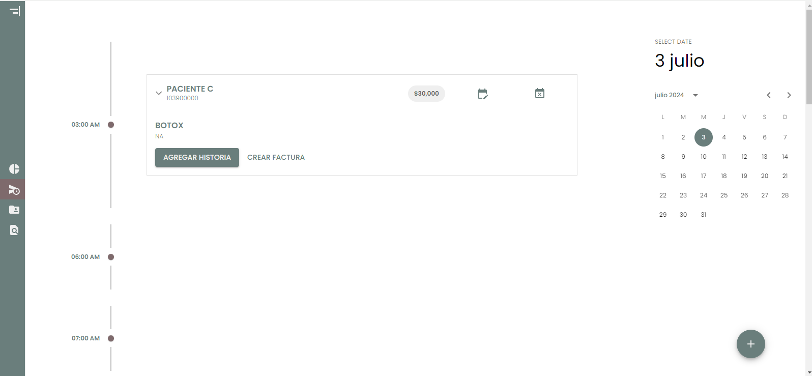

  <h1 align="center">
    Control y Agendamiento de Pacientes
     
     
    

      
      
      
      
    

    

      
    

  </h1>

## 🏥 Descripción

Bienvenido al repositorio de nuestra aplicación para el control y agendamiento de pacientes. Esta herramienta moderna y eficiente está diseñada para facilitar la gestión integral de citas médicas, historias clínicas, facturas y pagos. Desarrollada con tecnologías de vanguardia como Next.js, Spring Boot y MySQL, y desplegada en AWS utilizando Docker y RDS de Amazon.

---

## 🌟 Características Destacadas

- **Sistema de Login Seguro**: Autenticación robusta con Spring Boot y JWT.
- **Dashboard Interactivo**: Visualización dinámica de datos con gráficos informativos.
- **Agendamiento de Citas Intuitivo**: Gestión eficiente y flexible de citas médicas.
- **Registro Completo de Historias Clínicas**: Detalles médicos organizados y accesibles.
- **Gestión Financiera Eficaz**: Generación y seguimiento de facturas y pagos sin complicaciones.

---

## 🖼️ Capturas de Pantalla

### Pantalla de Login

  

### Dashboard con Gráficos

  

>

### Agenda

  

>

### Historia clinica

  

>

### Tablas de información

  

>
